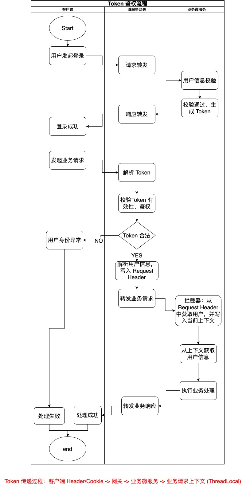

# 基于微服务架构的招聘SaaS平台
### 1. 核心模块功能介绍

- recruit-saas-common：定义通用工具类、枚举类、异常类、常用属性资源等等。

- recruit-saas-api：服务接口定义。

- recruit-saas-user-service：用户微服务。

- recruit-saas-company-service：企业微服务。

- recruit-saas-generator：代码生成器模块，用于 MyBatis 代码生成等。

- recruit-saas-gateway：网关服务，用于请求分发与路由、鉴权、黑白名单等控制。

- Recruit-auth-service：统一授权服务。

  

### 2. 端口规划

| 端口号 | 所属服务   |
| ------ | ---------- |
| 1xxx   | 用户微服务 |
| 2xxx   | 企业微服务 |
| 3xxx   | 授权服务   |
| 4xxx   | 工作微服务 |
| 8xxx   | 网关服务   |

### 3. 登录及 Token 校验流程

